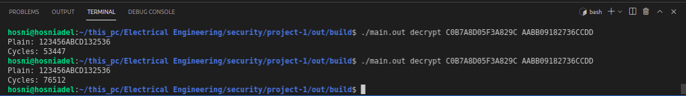

# Running the code

- To compile the project you should have **_CMake_** with minimum version **3.22.0-rc1**

  - In the project directory run the following command

  ```
  cmake -S . -B out/build
  ```

  - Run the Makefile in the build directory that generated by cmake

  ```
  cd out/build
  make
  ```

  > Executable file main.out will be generated

- Run the code:

  ```
  ./main.out encrypt <data> <key>
  ./main.out decrypt <data> <key>
  ```

  - Example:
  <p align="center">
    
  </p>
